# 🔥 Legion Remix Hub - Complete Guide & Resources

<div align="center">


**The Ultimate Comprehensive Guide for World of Warcraft Legion Remix 2025**

[](https://legionremixhub.com/)
[](https://nextjs.org/)
[](https://reactjs.org/)
[](https://www.typescriptlang.org/)
[](https://tailwindcss.com/)

**[🚀 Getting Started](https://legionremixhub.com/guides/getting-started)** •
**[📈 Leveling Guide](https://legionremixhub.com/guides/leveling)** •
**[💰 Bronze Farming](https://legionremixhub.com/guides/bronze-farming)** •
**[🎁 All Rewards](https://legionremixhub.com/rewards)** •
**[⚔️ Best Classes](https://legionremixhub.com/classes)**

</div>

---

## 📖 About Legion Remix Hub

Legion Remix Hub is a **comprehensive, community-driven resource** for World of Warcraft's Legion Remix: Skies of Fire event (October 7, 2025 - January 19, 2026). Our goal is to provide players with accurate, up-to-date information and tools to maximize their Legion Remix experience.

### ✨ What We Offer

- 📚 **Complete Guides**: Step-by-step tutorials for leveling, bronze farming, dungeons, raids, and more
- 🧮 **Bronze Calculator**: Plan your spending with our interactive bronze requirement calculator
- ⚔️ **Class Guides**: Detailed breakdowns for all 12 classes with specialization tips and Fel mount acquisition
- 🗓️ **Phase Tracker**: Real-time phase information with countdown timers
- 🎁 **Rewards Database**: Complete catalog of 100+ mounts, pets, transmogs, toys, and collectibles
- 🔍 **SEO Optimized**: Easily discoverable content to help the WoW community find the information they need

---

## 🎮 Key Features of Legion Remix

<table>
  <tr>
    <td width="50%">
      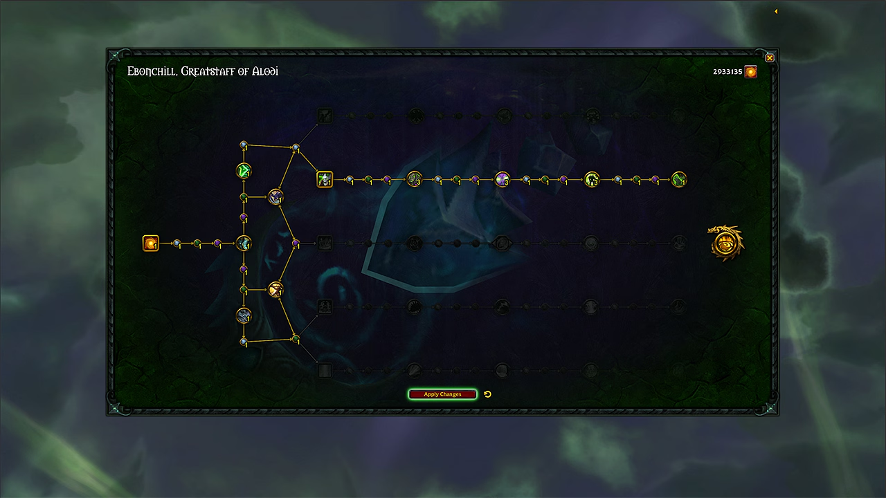
      <h3>⚔️ Infinite Artifact Weapons</h3>
      <p>All artifacts share a unified trait tree with 5 schools (Nature, Fel, Arcane, Storm, Holy Light). No power caps - scale infinitely!</p>
    </td>
    <td width="50%">
      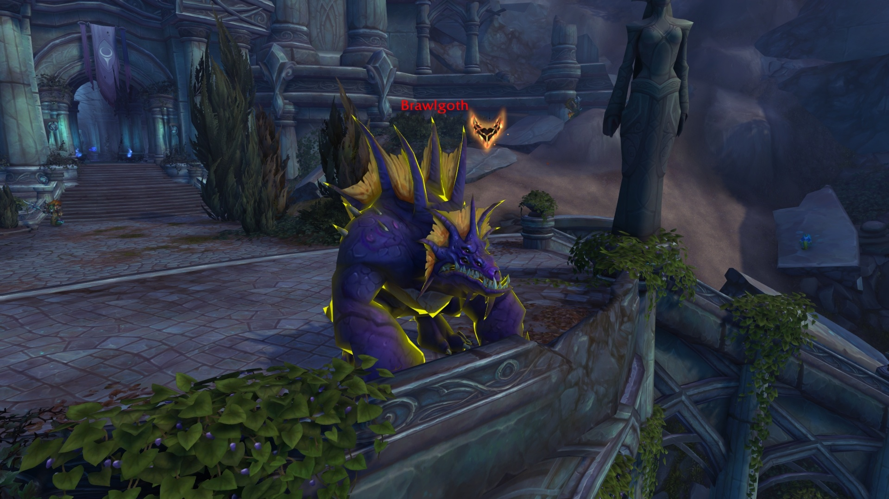
      <h3>🔥 Heroic World Tier</h3>
      <p>Opt-in Diablo-inspired difficulty with Empowered enemies (Imperious, Beacon of Chaos, Fel Raiser, Engorged) for increased rewards.</p>
    </td>
  </tr>
  <tr>
    <td width="50%">
      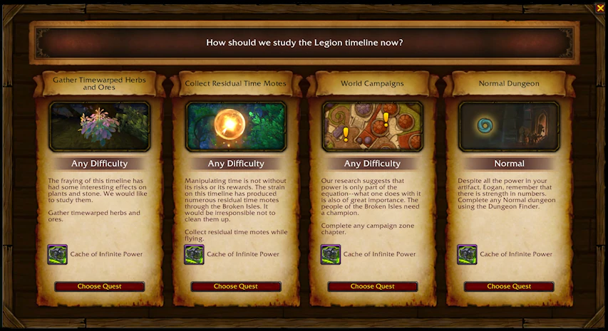
      <h3>📚 Infinite Research</h3>
      <p>Daily quest system with 100+ different research assignments. Bank up to 6 days of quests for flexible progression.</p>
    </td>
    <td width="50%">
      
      <h3>🌀 Timewarped Obelisks</h3>
      <p>Mysterious obelisks across the Broken Isles grant powerful buffs and spawn challenging elite encounters with loot.</p>
    </td>
  </tr>
</table>

---

## 🗓️ Event Timeline

<div align="center">

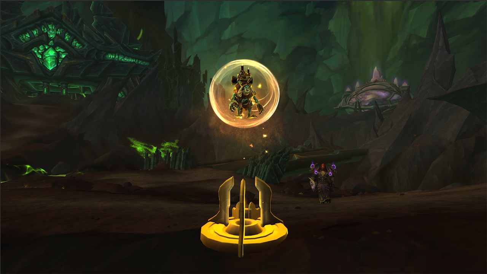

</div>

### Five Phases of Content

| Phase | Dates | Key Features |
|-------|-------|--------------|
| **🔥 Skies of Fire** | Oct 7 - Oct 20 | Event launch, Emerald Nightmare, EN/NH mythic keystones |
| **🌙 Rise of the Nightfallen** | Oct 21 - Nov 3 | Nighthold raid, NH mythic keystones, Suramar content |
| **⚔️ Legionfall** | Nov 4 - Nov 17 | Broken Shore, Tomb of Sargeras, ToS mythic keystones |
| **🪐 Argus Eternal** | Nov 18 - Dec 8 | Argus zones, Antorus raid, Antorus keystones, Violet Spellwing mount |
| **♾️ Infinite Echoes** | Dec 9 - Jan 19 | Housing decor, Timewarped Obelisks, Turbo Boost catch-up |

---

## 🎁 Exclusive Rewards Showcase

<table>
  <tr>
    <td align="center" width="50%">
      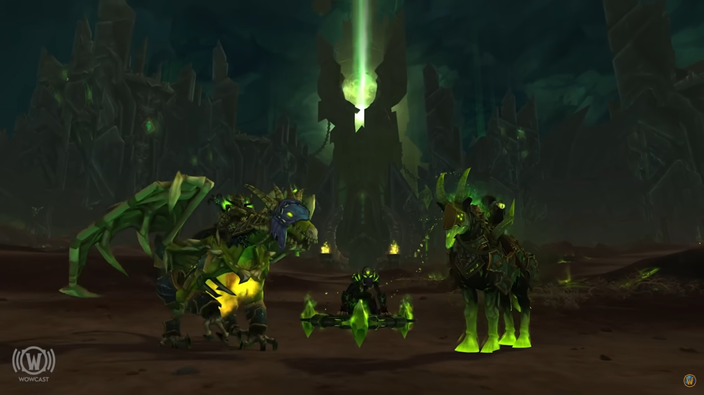
      <h3>🐎 Felscorched Class Mounts</h3>
      <p>Unique fel-infused variants of all 12 class mounts</p>
    </td>
    <td align="center" width="50%">
      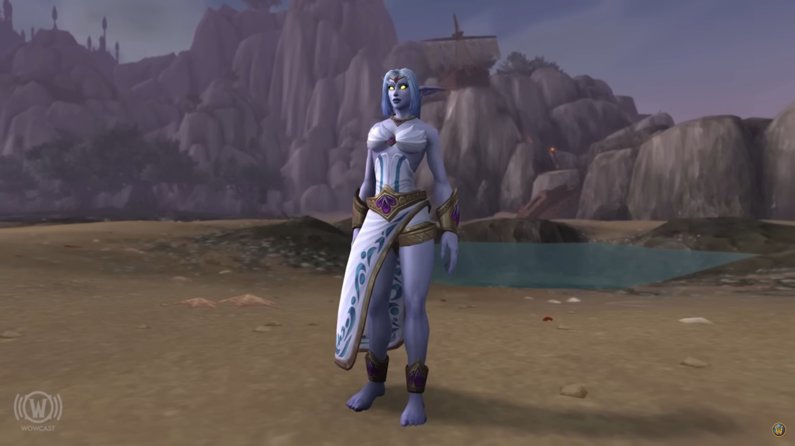
      <h3>👑 Azshara-Inspired Transmog</h3>
      <p>Brand new armor sets inspired by Queen Azshara</p>
    </td>
  </tr>
  <tr>
    <td align="center" width="50%">
      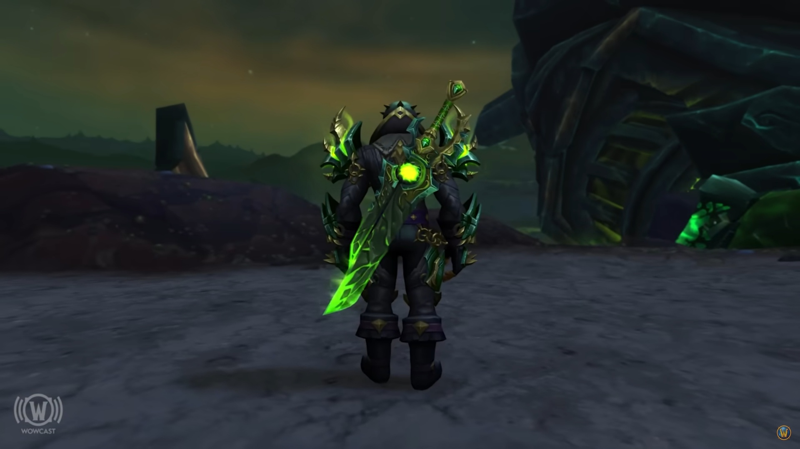
      <h3>⚔️ Legendary Weapons</h3>
      <p>Corrupted Shalamayne, Mannoroth's Shield, Scythe variants</p>
    </td>
    <td align="center" width="50%">
      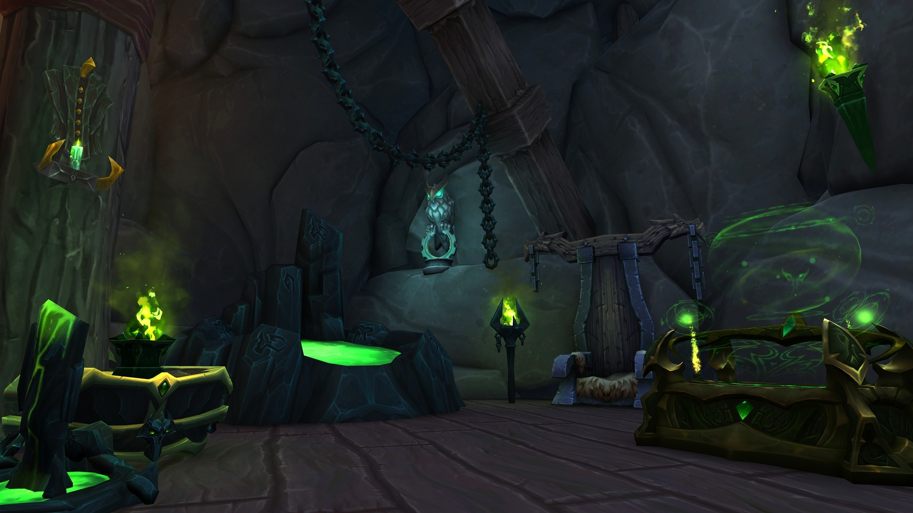
      <h3>🏠 Housing Decor</h3>
      <p>Unique Legion-themed decorations for player housing</p>
    </td>
  </tr>
</table>

**[📋 View Complete Rewards List (100+ Items)](https://legionremixhub.com/rewards)**

---

## 🚀 Quick Start Guide

### For Players

1. **🌐 Visit the Live Site**: [legionremixhub.com](https://legionremixhub.com/)
2. **📖 Read Getting Started**: Learn the [basics of Legion Remix](https://legionremixhub.com/guides/getting-started)
3. **⚔️ Choose Your Class**: Check our [class guides](https://legionremixhub.com/classes) to pick the best class for your playstyle
4. **📈 Follow the Leveling Guide**: Use our [optimized leveling routes](https://legionremixhub.com/guides/leveling)
5. **💰 Farm Bronze Efficiently**: Master [bronze farming methods](https://legionremixhub.com/guides/bronze-farming)
6. **🧮 Plan Your Spending**: Use the [Bronze Calculator](https://legionremixhub.com/calculator) for your wishlist

### For Developers

```bash
# Clone the repository
git clone https://github.com/mengjian-github/legion-remix-hub.git
cd legion-remix-hub

# Install dependencies
npm install

# Run development server
npm run dev

# Build for production
npm run build

# Start production server
npm start
```

Visit [http://localhost:3000](http://localhost:3000) to see the site locally.

---

## 🛠️ Tech Stack

This project is built with modern web technologies for optimal performance and SEO:

| Technology | Purpose | Version |
|------------|---------|---------|
| **Next.js** | React framework with App Router | 15.5.4 |
| **React** | UI library | 19.1.0 |
| **TypeScript** | Type-safe JavaScript | ^5 |
| **Tailwind CSS** | Utility-first CSS framework | ^4 |
| **Vercel** | Hosting and deployment | - |

### Key Features

- ⚡ **Turbopack**: Next-generation bundler for ultra-fast builds
- 🎨 **Tailwind CSS 4**: Latest utility-first styling
- 📱 **Responsive Design**: Mobile-first, works on all devices
- 🔍 **SEO Optimized**: Meta tags, Open Graph, structured data
- 🌐 **Google Analytics**: Integrated traffic tracking
- 🚀 **Static Generation**: Lightning-fast page loads
- ♿ **Accessible**: WCAG compliant components

---

## 📂 Project Structure

```
legion-remix-hub/
├── app/                      # Next.js App Router pages
│   ├── classes/             # Class guide pages
│   ├── guides/              # Guide pages (leveling, bronze, etc)
│   ├── rewards/             # Rewards catalog
│   ├── calculator/          # Bronze calculator tool
│   ├── layout.tsx           # Root layout with analytics
│   └── page.tsx             # Homepage
├── components/              # React components
│   ├── ui/                  # Reusable UI components
│   │   ├── Countdown.tsx    # Event countdown timer
│   │   ├── Navigation.tsx   # Site navigation
│   │   └── Footer.tsx       # Site footer
│   └── ...
├── data/                    # Game data
│   ├── classes.ts           # Class information
│   ├── timeline.ts          # Phase dates and info
│   ├── rewards.ts           # Rewards database
│   └── images.ts            # Image paths
├── lib/                     # Utility functions
│   └── seo.ts              # SEO helpers
├── public/                  # Static assets
│   ├── images/game/        # Game screenshots
│   └── ...
└── package.json            # Dependencies
```

---

## 📊 Analytics & SEO

This project includes comprehensive SEO optimizations:

- ✅ **Meta Tags**: Title, description, keywords for all pages
- ✅ **Open Graph**: Rich previews on social media
- ✅ **Canonical URLs**: Prevent duplicate content issues
- ✅ **Structured Data**: JSON-LD for search engines
- ✅ **Sitemap**: XML sitemap for crawlers
- ✅ **Responsive Images**: Optimized for all screen sizes
- ✅ **Google Analytics**: Track user engagement (GA4)

---

## 🤝 Contributing

We welcome contributions from the WoW community! Here's how you can help:

### Ways to Contribute

- 🐛 **Report Bugs**: Found an error? [Open an issue](https://github.com/mengjian-github/legion-remix-hub/issues)
- 💡 **Suggest Features**: Have an idea? Share it with us
- 📝 **Improve Content**: Update guides with new strategies
- 🎨 **Design**: Enhance UI/UX
- 🌐 **Translations**: Help translate content (future)

### Development Workflow

1. Fork the repository
2. Create a feature branch (`git checkout -b feature/amazing-feature`)
3. Make your changes
4. Commit your changes (`git commit -m 'Add amazing feature'`)
5. Push to your branch (`git push origin feature/amazing-feature`)
6. Open a Pull Request

---

## 📜 License

This project is open source and available under the [MIT License](LICENSE).

**Note**: World of Warcraft and all related content are trademarks of Blizzard Entertainment, Inc. This is a fan-made resource and is not affiliated with or endorsed by Blizzard Entertainment.

---

## 🌟 Support & Community

- 🌐 **Website**: [legionremixhub.com](https://legionremixhub.com/)
- 🐙 **GitHub**: [github.com/mengjian-github/legion-remix-hub](https://github.com/mengjian-github/legion-remix-hub)
- 📧 **Contact**: Open an issue for questions or feedback

---

## 🎯 Roadmap

### Current Features
- ✅ Complete guide system (leveling, bronze farming, dungeons, raids)
- ✅ Interactive bronze calculator
- ✅ Class guides for all 12 classes
- ✅ Rewards database with 100+ items
- ✅ Phase tracker with countdown
- ✅ Responsive design
- ✅ SEO optimization

### Upcoming Features
- 🔜 User accounts (save favorites, track progress)
- 🔜 Community tips section
- 🔜 Video guide integration
- 🔜 Mobile app (PWA)
- 🔜 Multilingual support
- 🔜 Achievement tracker

---

## 📸 Screenshots

<div align="center">

### Homepage Hero Section


### Phase Timeline & Roadmap


### Class Mount Showcase
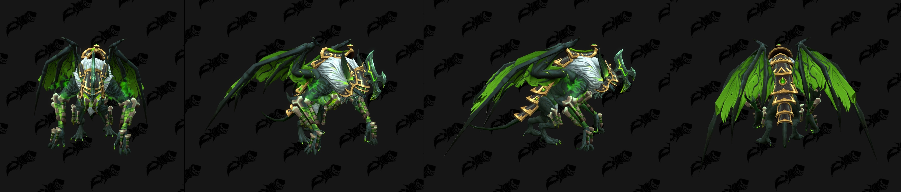 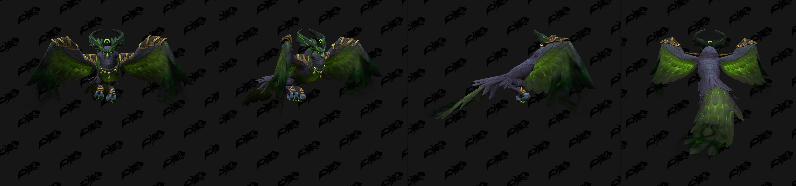 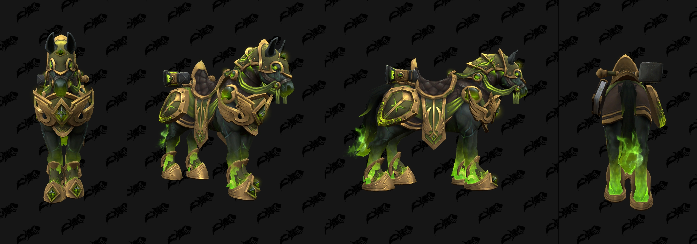

### Exclusive Rewards
 

</div>

---

<div align="center">

### ⚡ Built with passion for the WoW community

**[🌐 Visit Legion Remix Hub Now](https://legionremixhub.com/)**

Made with 💚 by [mengjian-github](https://github.com/mengjian-github)

**If you find this resource helpful, please give it a ⭐ star!**

</div>
